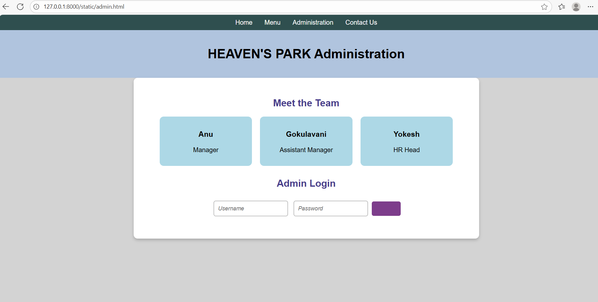

# Ex.07 Restaurant Website
## Date:07/10/2025

## AIM:
To develop a static Restaurant website to display the food items and services provided by them.

## DESIGN STEPS:

### Step 1:
Requirement collection.

### Step 2:
Creating the layout using HTML and CSS.

### Step 3:
Updating the sample content.

### Step 4:
Choose the appropriate style and color scheme.

### Step 5:
Validate the layout in various browsers.

### Step 6:
Validate the HTML code.

### Step 7:
Publish the website in the given URL.

## PROGRAM:
```
<html>
<head>=
    <title>HEAVEN'S PARK</title>

    <style>
        body {
            font-family: Arial, sans-serif;
            font-size: medium;
            font-style:italic;
            margin: 0;
            padding: 0;
            background-color: rgb(255, 255, 255);
        }
        header {
            background-color: rgb(179, 188, 245);
            text-align: center;
            padding: 20px;
        }
        header img {
            width: 40px;
        }
        nav {
            background-color: rgb(128, 128, 128);
            color: white;
            display: flex;
            justify-content: center;
            padding: 10px 0;
        }
        nav a {
            text-decoration: none;
            color: white;
            margin: 0 15px;
        }
        .banner {
            text-align: right;
            background-image: url('banner.png');
            background-size: cover;
            background-position: center;
            color: white;
            padding: 50px;
        }
        .banner h2 {
            margin: 0;
        }
        .banner p {
            margin-top: 10px;
        }
        .sections {
            display: flex;
            justify-content: space-around;
            padding: 20px;
            gap: 10px;
        }
        .section {
            background-color: wheat;
            padding: 15px;
            border-radius: 10px;
            text-align: center;
            width: 20%;
        }
        .section img {
            width: 100%;
            border-radius: 10px;
        }
        footer {
            text-align: center;
            background-color: rgb(255, 255, 255);
            padding: 10px;
            margin-top: 16px;
        }
        footer a {
            text-decoration: wavy;
            color: blanchedalmond;
        }
    </style>
</head>
<body>

<header>
    <h1>HEAVEN'S PARK</h1>
</header>

<nav>
    <a href="cover.html">Home</a>
    <a href="menu.html">Menu</a>
    <a href="admin.html">Administration</a>
    <a href="contact.html">Contact Us</a>
</nav>

<div class="banner">
    <h2>50% Off This Weekend</h2>
</div>

<div class="sections">
    <div class="section">
         
        <h3>Our New Menu</h3>
        <p>Explore a variety of mouthwatering dishes crafted to satisfy every taste. From savory appetizers to hearty main courses, there's something for everyone.</p>
        <a href="menu.html">See our new menu</a>
    </div>
    <div class="section">
         
        <h3>Reserve Your Spot</h3>
        <p>Enjoy an unforgettable dining experience at HEAVEN'S PARK. Book your table and treat yourself with a wonderful dish in a cozy ambiance.</p>
        <a href="booktable.html">Book your table now</a>
    </div>
    <div class="section">
         
        <h3>Opening Hours</h3>
        <p>
            Mon - Fri: 10am - 10pm<br>
            Sat: 2pm - 11pm<br>
            Sun: 2pm - 9pm
        </p>
    </div>
</div>

</body>
</html>

<html>
<head>
    <title>Administration - HEAVEN'S PARK</title>
    <style>
        body {
            font-family: Arial, sans-serif;
            margin: 0;
            padding: 0;
            background-color: rgb(211, 211, 211);
        }
        nav {
            background-color: darkslategray;
            color: white;
            display: flex;
            justify-content: center;
            padding: 10px 0;
        }
        nav a {
            text-decoration: none;
            color: white;
            margin: 0 15px;
        }
        header {
            text-align: center;
            background-color: lightsteelblue;
            padding: 20px;
        }
        .admin-section {
            padding: 30px;
            max-width: 800px;
            margin: auto;
            background-color: white;
            border-radius: 10px;
            box-shadow: 0 4px 8px rgba(0, 0, 0, 0.2);
        }
        .admin-section h2 {
            text-align: center;
            color: darkslateblue;
            margin-bottom: 20px;
        }
        .admin-team {
            display: flex;
            flex-wrap: wrap;
            gap: 20px;
            justify-content: center;
        }
        .team-member {
            background-color: lightblue;
            border-radius: 10px;
            padding: 15px;
            text-align: center;
            width: 200px;
        }
        .team-member img {
            width: 100%;
            border-radius: 10px;
            margin-bottom: 10px;
        }
        .admin-login {
            margin-top: 30px;
            text-align: center;
        }
        .admin-login input {
            padding: 10px;
            margin: 10px 5px;
            border: 1px solid gray;
            border-radius: 5px;
            font-size: 14px;
            font-style: oblique;
        }
        .admin-login button {
            padding: 10px 20px;
            background-color: rgb(125, 61, 139);
            color: rgba(255, 255, 255, 0);
            border: none;
            border-radius: 5px;
            cursor: pointer;
        }
        .admin-login button:hover {
            background-color: slateblue;
        }
    </style>
</head>
<body>

<nav>
    <a href="cover.html">Home</a>
    <a href="menu.html">Menu</a>
    <a href="adminstration.html">Administration</a>
    <a href="contact.html">Contact Us</a>
</nav>

<header>
    <h1>HEAVEN'S PARK Administration</h1>
</header>

<div class="admin-section">
    <h2>Meet the Team</h2>
    <div class="admin-team">
        <div class="team-member">
            <h3>Anu</h3>
            <p>Manager</p>
        </div>
        <div class="team-member">
            <h3>Gokulavani</h3>
            <p>Assistant Manager</p>
        </div>
        <div class="team-member">
            <h3>Yokesh</h3>
            <p>HR Head</p>
        </div>
    </div>

    <div class="admin-login">
        <h2>Admin Login</h2>
        <form>
            <input type="text" placeholder="Username" required>
            <input type="password" placeholder="Password" required>
            <button type="submit">Login</button>
        </form>
    </div>
</div>

</body>
</html>

<html>
<head>
    <style>
        body {
            font-family: Arial, sans-serif;
            margin: 0;
            padding: 0;
            background-color: rgba(211, 211, 211, 0.029);
        }
        nav {
            background-color: darkslategray;
            color: white;
            display: flex;
            justify-content: center;
            padding: 10px 0;
        }
        nav a {
            text-decoration: none;
            color: white;
            margin: 0 15px;
        }
        header {
            text-align: center;
            background-color: lightsteelblue;
            padding: 20px;
        }
        .menu-section {
            padding: 30px;
            max-width: 1000px;
            margin: auto;
        }
        .menu-title {
            text-align: center;
            color: darkslateblue;
            margin-bottom: 20px;
        }
        .menu-items {
            display: flex;
            flex-wrap: wrap;
            gap: 20px;
            justify-content: center;
        }
        .menu-item {
            background-color: white;
            border-radius: 10px;
            box-shadow: 0 4px 8px rgba(0, 0, 0, 0.2);
            text-align: center;
            padding: 15px;
            width: 250px;
        }
        .menu-item img {
            width: 100%;
            border-radius: 10px;
            margin-bottom: 10px;
        }
        .menu-item h3 {
            color: darkslateblue;
            margin: 10px 0;
        }
        .menu-item p {
            color: gray;
            font-size: 14px;
            font-style: oblique;
        }
        .menu-item span {
            display: block;
            font-size: 18px;
            font-style: oblique;
            font-weight: bold;
            color: darkslategray;
            margin-top: 10px;
        }
    </style>
</head>
<body>

<nav>
    <a href="cover.html">Home</a>
    <a href="menu.html">Menu</a>
    <a href="admin.html">Administration</a>
    <a href="contact.html">Contact Us</a>
</nav>

<header>
    <h1>Our Menu</h1>
</header>

<div class="menu-section">
    <h2 class="menu-title">Explore our dishes</h2>
    <div class="menu-items">
        <div class="menu-item">
            
            <h3>Classic pasta</h3>
            <p>Pasta is a type of food typically made from an unleavened dough of wheat flour mixed with water or eggs, and formed into sheets or other shapes, then cooked by boiling or baking.</p>
            <span>Rs. 100</span>
        </div>
        <div class="menu-item">
            
            <h3>Schezwan noodles</h3>
            <p>This dish provides a spicy, aromatic, and crunchy texture, combining the bold flavors of Chinese Sichuan cuisine with the comfort of a noodle dish. .</p>
            <span>Rs. 220</span>
        </div>
        
        <div class="menu-item">
            
            <h3>Grilled Salmon</h3>
            <p>Perfectly grilled salmon served with steamed vegetables and a lemon butter sauce.Fear of it sticking to the grill, of flaking into bits when handling it. Or of the sugar in marinades causing it to burn into a black bitter mess.</p>
            <span>Rs. 340</span>
        </div>
    </div>
</div>

</body>
</html>

<html>
<head>
    <title>Contact Us - HEAVEN'S PARK</title>
    <style>
        body {
            font-family: Arial, sans-serif;
            margin: 0;
            padding: 0;
            background-color: white;
        }
        nav {
            background-color: rgb(128, 128, 128);
            color: white;
            display: flex;
            justify-content: center;
            padding: 10px 0;
        }
        nav a {
            text-decoration: none;
            color: white;
            margin: 0 15px;
        }
        header {
            text-align: center;
            background-color: white;
            padding: 20px;
        }
        .contact-section {
            padding: 30px;
            max-width: 600px;
            margin: auto;
            background: white;
            border-radius: 10px;
            box-shadow: 0 0 10px rgba(0, 0, 0, 0.1);
        }
        .contact-section h2 {
            text-align: center;
            margin-bottom: 20px;
        }
        .contact-section form {
            display: flex;
            flex-direction: column;
            gap: 15px;
        }
        .contact-section input, .contact-section textarea, .contact-section button {
            padding: 10px;
            font-size: 16px;
            font-style: oblique;
            border: 1px solid whitesmoke;
            border-radius: 5px;
        }
        .contact-section textarea {
            resize: none;
            height: 100px;
        }
        .contact-section button {
            background-color: #4a4a4a;
            color: white;
            cursor: pointer;
        }
    </style>
</head>
<body>

<nav>
    <a href="cover.html">Home</a>
    <a href="menu.html">Menu</a>
    <a href="admin.html">Administration</a>
    <a href="contact.html">Contact Us</a>
</nav>

<header>
    <h1>Contact Us</h1>
    
</header>

<div class="contact-section">
    <h2>Any Queries contact us ,We'd Love to Hear from You!</h2>
    <form>
        <input type="text" name="name" placeholder="Your Full Name" required>
        <input type="email" name="email" placeholder="Your Email" required>
        <input type="tel" name="phone" placeholder="Your Phone Number (optional)">
        <textarea name="message" placeholder="Your Message..." required></textarea>
        <button type="submit">Send Message</button>
    </form>
</div>

</body>
</html>
```


## OUTPUT:





## RESULT:
The program for designing software company website using HTML and CSS is completed successfully.
