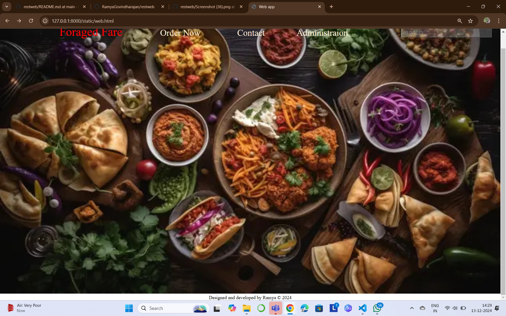

# Ex.07 Restaurant Website
## Date:13/12/2024

## AIM:
To develop a static Restaurant website to display the food items and services provided by them.

## DESIGN STEPS:

### Step 1:
Requirement collection.

### Step 2:
Creating the layout using HTML and CSS.

### Step 3:
Updating the sample content.

### Step 4:
Choose the appropriate style and color scheme.

### Step 5:
Validate the layout in various browsers.

### Step 6:
Validate the HTML code.

### Step 7:
Publish the website in the given URL.

## PROGRAM:
```
web.html

<!DOCTYPE html>
<html lang="en">
<head>
    <meta charset="UTF-8">
    <meta name="viewport" content="width=device-width, initial-scale=1.0">
    <title>Web app</title>
    <link rel="stylesheet" href="web.css">
</head>
<body>
    <div  id="template">

       
        <a href="Ocean_food.html" id="tag" >Foraged Fare</a>
        <a href="order_now.html" id="order">Order Now </a>
        <a href="contact.html" id="contact">Contact</a>
        <a href="administration.html" id="offers">Administraion</a>
        <input type="text" placeholder="search" id="search">

    </div>
     <footer align="center" id="copywrite bg-color:pink">
        Designed and developed by Ramya &copy 2024
    </footer>


</body>
</html>

web.css

*{
    margin: 0px;
    padding: 0px;
}

#template
{
    align-items: center;
    width: 100%;
    height: auto;
}
#img
{
    width: 100%;
    object-fit: cover;
}
#tag
{
    position: absolute;
    top:40px;
    left: 200px;
    text-decoration: none;
    color: antiquewhite;
    font-weight: 400;
    color: red;
    text-transform: capitalize;
    font-size: 40px;
    
}
#order
{
    position: absolute;
    top:50px;
    left: 540px;
    text-decoration: none;
    color: antiquewhite;
    font-weight: 400;
    font-size: 30px;
}
#contact
{
    position: absolute;
    top:50px;
    left: 800px;
    text-decoration: none;
    color: antiquewhite;
    font-weight: 400;
    font-size: 30px; 
}
#offers
{
    position: absolute;
    top:50px;
    left: 1000px;
    text-decoration: none;
    color: antiquewhite;
    font-weight: 400;
    font-size: 30px;   
}
#search
{
    position: absolute;
    top:50px;
    left: 1350px;
    text-decoration: none;
    color: antiquewhite;
    font-weight: 400;
    font-size: 30px; 
    background-color: rgba(255,255,255,0.2); 
    border-color: black;
    font-size: 25px;
}
#copywrite
{
    background-color: rgb(255, 115, 0);
    color:black;
    font-size: large;
}

order_now.html

<!DOCTYPE html>
<html lang="en">
<head>
    <meta charset="UTF-8">
    <meta name="viewport" content="width=device-width, initial-scale=1.0">
    <title>order now</title>
    <style>
        #body1{
            background-color: red;
        }
        #body
        {
            border: 5px solid black;
           color: black;
           background-color:yellow;
            border-radius: 25px;
            height: 1500px;
        }
         img
        {
                margin-top: 100px;
                height: 200px;
                width: auto;
                margin-left: 25px;

        } 
        #fish
        {
            height: 200px;
            width: 300px;
        }
        .dish
        {
           margin-left: 240px;
        }
        #dish1
        {
            margin-left: 280px;
        }
        #dish2
        {
            margin-left: 20px;
        }
        p{
            margin-top: 75px;
            margin-left: 250px;
            font-size: 25px;
        }
        #tandoori
        {
            position: absolute;
            left: 1050px;
        }
    </style>
</head>
<body>
    <div id="body">
    <h1 align="center" style="text-decoration: underline wavy purple;">Enjoy your meels</h1>
    <div id="body1" >
        
        
        
        
        
        <b class ="dish"  id="dish2">chiili garlic prawns</b>
        <b class ="dish" >chicken lolipop</b>
        <b class ="dish " id="dish1" >chicken manjurian</b>
        <b id="tandoori" >tandoori </b>
        
    </div>
    </div>
</body>
</html>

Ocean_food.html

<!DOCTYPE html>
<html lang="en">
<head>
    <meta charset="UTF-8">
    <meta name="viewport" content="width=device-width, initial-scale=1.0">
    <title>restorent</title>
    <style>
        pre
        {
            padding: 15px;
            font-size: large;
            font-family: 'Gill Sans', 'Gill Sans MT', Calibri, 'Trebuchet MS', sans-serif;
            
        }
       #order
        {
                display: inline;
                margin-left: 10px;
                color: blueviolet;
        }
        #h1
        {
            text-align: center;
            font-style: oblique;
            margin-top: 10px;
            padding: 25px;
            position: relative;
            top: 50px;
            left: 0px;
            background-color: red;
        }
        body
        {
            background-color: yellow;
        }
    </style>
</head>
<body >
    
    <h1 id="h1">About Us - Foraged Fare</h1>
    <pre>
        

Welcome to Foraged Fare,  a culinary destination where nature’s bounty is transformed into unforgettable dining experiences. <br> Our philosophy is simple great food starts with great ingredients. We focus on using  locally foraged, sustainable, and seasonal ingredients to craft unique dishes that showcase the rich flavors of the earth.

    At Foraged Fare, we pride ourselves on sourcing fresh, wild ingredients directly from local forests, fields, and waterways. <br> From wild mushrooms and herbs to handpicked berries <br>and edible flowers, each item on our menu is a tribute to the natural world. Our team of skilled chefs transforms these treasures into mouthwatering dishes, <br> combining creativity and tradition for an experience that celebrates the flavors of nature.
    
    Whether you’re here for a casual meal or a special occasion, we offer a warm, inviting atmosphere where every dish is carefully crafted to delight the senses. <br> Our menus evolve with the seasons, ensuring that every visit brings something new and exciting to the table.
    
    At Foraged Fare, we believe in food that connects you to the land. Join us to taste the wild, explore the season, and experience a truly unforgettable meal.
    
    Foraged Fare – Where nature meets the plate.
    
    </pre>

</body>
</html>

contact.html

<!DOCTYPE html>
<html lang="en">
<head>
    <meta charset="UTF-8">
    <meta name="viewport" content="width=device-width, initial-scale=1.0">
    <link href="https://cdnjs.cloudflare.com/ajax/libs/font-awesome/6.0.0-beta3/css/all.min.css" rel="stylesheet">  
    <style>
      *{
        font-family: Arial, Helvetica, sans-serif;
      }
        #contact
        {
            background: linear-gradient(to bottom,red,yellow,red);
            display: flex;
            font-size: 30px;
            gap: 10px;
            background-color:	rgba(250, 235, 215,0.2);
            border: 1px inset black;
            height: 800px;
        }
        #contact>div{
            width: 30%;
            /* border: 5px solid pink; */
            padding: 50px;
        }
        #div1
        {
            position: absolute;
            top:40px;
            right: 100px;
            border:1px inset whitesmoke;
            background-color: whitesmoke;
            border-radius: 50px;
        }
        input{
            font-size: 25px;
            margin-left: 30px;
        }
        #textarea
        {
          margin-left: 25px;
          padding: 20px;
          border: #FFFFFF;
          padding: 10px;
          border-radius: 10px;
          font-size: 20px;
        }

        #submit
        {
          background-color: #FF5200;
          border-radius: 10px;
          color: whitesmoke;
        }
        #label2
        {
          border: whitesmoke;
          padding: 10px;
          border-radius: 10px;

        }
        #label1
        {
          border: whitesmoke;
          padding: 10px;
          border-radius: 10px;
        }
        #info
        {
          padding: 20px;
          
          
        }

    </style>
    <script>
            function f1()
            {
                document.getElementById("label3").innerHTML="Informations are saved";
            }
    </script>
    
</head>
<body>
    <div id="contact">
      
           <div id="info">
              <b style="text-decoration: underline ;"> Foraged Fare</b>
              <br>
              <br>
              <b style="font-size: 50px;">Customer <br> Support</b>
              <br>
              <p>Email:suppor@foragedfare.in</p>
              <br><br>
              <b>Find us on</b>
              <br>
             <!-- <i class='fab fa-instagram' style='font-size:48px;color:red'></i> 
             <a href="ameenbashanawaz.123@gmail.com" class="fa fa-linkedin">	</a>
              <a href="#" class="fa fa-pinterest"></a>
               -->
               <i class="fab fa-instagram"  style="font-size: 50px; color: #E4405F ; margin-left: 20px; padding: 20px;"></i>
               <i class="fab fa-facebook-f"   style="font-size: 50px; color: #3b5998;  margin-left: 20px; padding: 20px;"></i>
               <i class="fab fa-linkedin-in"  style="font-size: 50px; color: #0077b5; margin-left: 20px; padding: 20px;"></i>
               <i class="fab fa-twitter"  style="font-size: 50px; color: #0077b5; margin-left: 20px; padding: 20px;"></i>
               <pre>

               </pre>
            </div>
        <div  id="div1">
            <hr style="font-style: italic;">
            <b align="center"> Get in touch </b>
            <br>
            <br>

            <label id="label2"><input type="text" id="label2" placeholder="Enter Name"></label>
            <br>
            <br>
            <label id="label1"> <input type="text" id="label1"  placeholder="Enter Number"></label>
            <br>
            <br>
            <label ><textarea  id="textarea" placeholder="Enter Message"  rows="10" cols="50"></textarea></label>
            <br>
            <br>
            <label id="label3"> <input type="submit"  id="submit" placeholder="Enter" onclick="f1()"></label>
            <hr>
        </div>

    </div>
</body>
</html>

administration.html

<!DOCTYPE html>
<html lang="en">
<head>
    <meta charset="UTF-8">
    <meta name="viewport" content="width=device-width, initial-scale=1.0">
    <title>Administraion</title>
    <style>
        body
        {
            background-color: rgba(255, 60, 0, 0.733);
        }
        #container
        {
            background-color: whitesmoke;
            display: flex;
            border: 5px solid aquamarine;
            height: 500px;
            width: auto;
            justify-content: space-evenly;
            border-radius: 100px;
        }
        #main
        {
            border: 1px solid black;
        }
        .box
        {
            position: relative;
            display: inline-block;
            top: 150px;
            height: 200px;
            width: 200px;
            border: 2px solid black;
            background-color: pink;
            border-radius: 50%;
        }
        #head
        {
            text-align: center;
            font-size: 40px;
            font-family: 'Times New Roman', Times, serif;
            font-weight: 700;
            background-size:cover ;
        }
        #name
        {
            justify-content: space-evenly;
        }
        #n1
        {
            position: absolute;
            bottom: 170px;
            left: 100px;
            font-weight: 600;
            font-size: large;
            font-style: oblique;
        }
        #n2
        {
            position: absolute;
            bottom: 170px;
            left: 320px;
            font-weight: 600;
            font-size: large;
            font-style: oblique;
        }
        #n3
        {
            position: absolute;
            bottom: 170px;
            left: 550px;
            font-weight: 600;
            font-size: large;
            font-style: oblique;
        }
        #n4
        {
            position: absolute;
            bottom: 170px;
            left: 800px;
            font-weight: 600;
            font-size: large;
            font-style: oblique;
        }
        #n5
        {
            position: absolute;
            bottom: 170px;
            left: 1050px;
            font-weight: 600;
            font-size: large;
            font-style: oblique;
        }
    </style>
    
</head>
<body>
    <div align="center" id="head">workers</div>
    <div id="container">

            <div ></div>
            <div ></div>
            <div ></div>
            <div ></div>
            <div ></div>

    </div>
    <p id="n1">K. Damodharan </p> 
        <p id="n2">chef suryansh</p>
         <p id="n3">Chef Arnold</p>
        <p id="n4">Vikas  Khanna</p>  
        <p id="n5">Sanjeev Kapoor</p>
</body>
</html>

```


## OUTPUT:

.png>)
.png>)
.png>)
.png>)
## RESULT:
The program for designing software company website using HTML and CSS is completed successfully.
